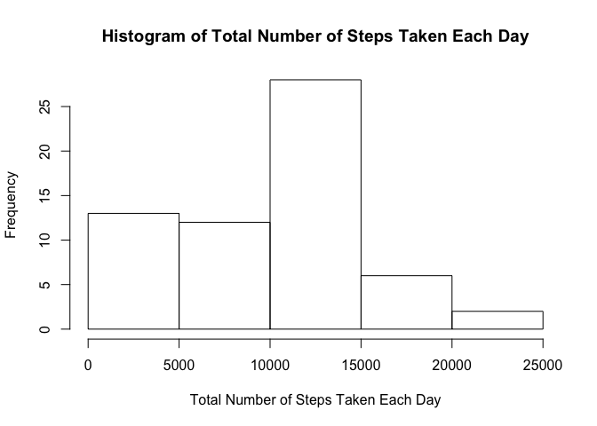
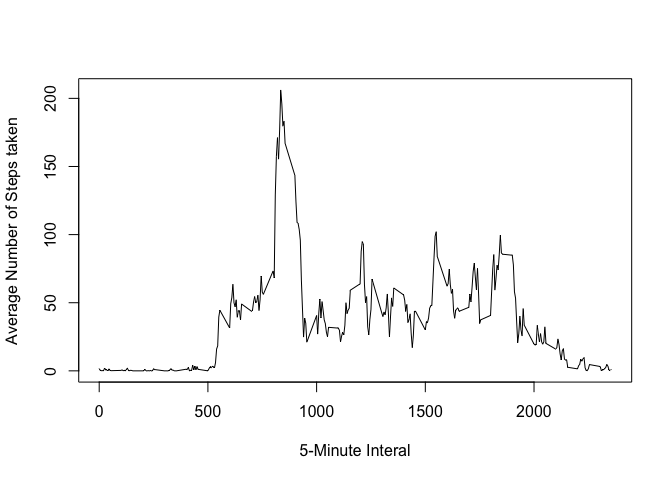
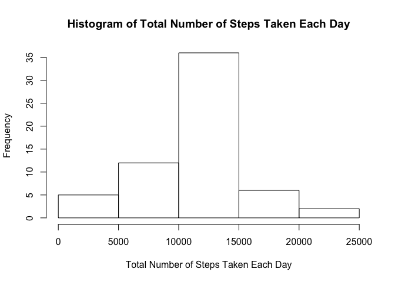
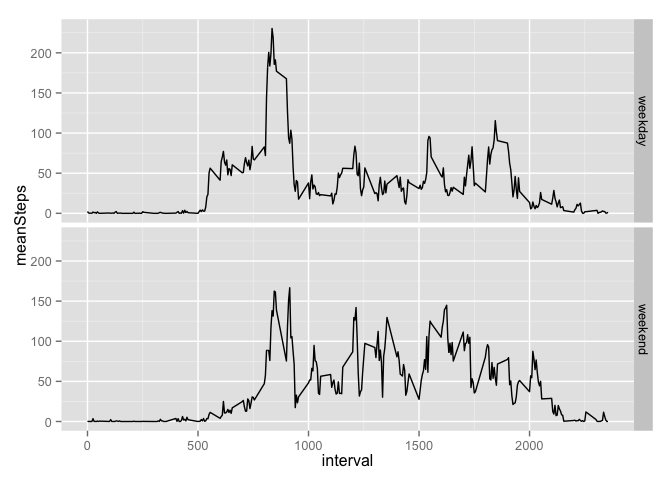

# Reproducible Research: Peer Assessment 1


## Loading and preprocessing the data

```r
data <- read.csv("./activity.csv")
```


## What is mean total number of steps taken per day?

```r
perday <- with(data, tapply(steps, date, sum, na.rm = TRUE))
hist(perday, xlab = "Total Number of Steps Taken Each Day", main = "Histogram of Total Number of Steps Taken Each Day")
```

 

```r
mean(perday)
```

```
## [1] 9354.23
```

```r
median(perday)
```

```
## [1] 10395
```

## What is the average daily activity pattern?

```r
perInterval <- with(data, tapply(steps, interval, mean, na.rm = TRUE))
plot(names(perInterval), perInterval, type = "l", xlab = "5-Minute Interal", ylab = "Average Number of Steps taken")
```

 

```r
names(which.max(perInterval))
```

```
## [1] "835"
```


## Imputing missing values

```r
sum(is.na(data$steps))
```

```
## [1] 2304
```

```r
processed <- lapply(1: nrow(data), function(i) {
        if (is.na(data[i,"steps"])) {
                data[i, "steps"] <- perInterval[names(perInterval) == data[i, "interval"]]
        }
        return(c(steps = data[i, "steps"], date = data[i, "date"], interval = data[i, "interval"]))
})
filled <- data.frame(do.call(rbind, processed))
filled$date <- data$date
perdayfilled <- with(filled, tapply(steps, date, sum, na.rm = TRUE))
hist(perdayfilled, xlab = "Total Number of Steps Taken Each Day", main = "Histogram of Total Number of Steps Taken Each Day")
```

 

```r
mean(perdayfilled)
```

```
## [1] 10766.19
```

```r
median(perdayfilled)
```

```
## [1] 10766.19
```


## Are there differences in activity patterns between weekdays and weekends?

```r
determineWeekend <- function(x) {
        if (weekdays(as.Date(x)) %in% c("Saturday", "Sunday")) {
                return ("weekend")
        } else {
                return ("weekday")
        }
}
filled$week <- sapply(filled$date, determineWeekend)
filled$week <- as.factor(filled$week)
library(dplyr)
```

```
## 
## Attaching package: 'dplyr'
## 
## The following object is masked from 'package:stats':
## 
##     filter
## 
## The following objects are masked from 'package:base':
## 
##     intersect, setdiff, setequal, union
```

```r
grouped <- group_by(filled, interval, week)
summary <- summarise(grouped, meanSteps = mean(steps))
library(ggplot2)
ggplot(summary, aes(interval, meanSteps)) + geom_line() + facet_grid(week~.)
```

 
